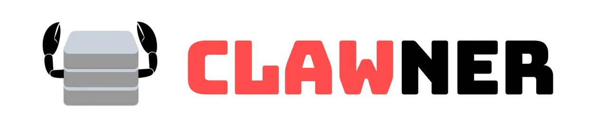

<p align="center">
  
</p>

<p align="center">
  <strong>Remote orchestrator for OpenClaw agents</strong>
</p>

<p align="center">
  <a href="#features">Features</a> •
  <a href="#quick-start">Quick Start</a> •
  <a href="#api">API</a> •
  <a href="#commands">Commands</a>
</p>

---

## Features

- **Real-time monitoring** — See all connected hosts and their status
- **Remote commands** — Start/stop gateway, manage agents, view logs
- **Heartbeat telemetry** — CPU, memory, load averages every 30s
- **Web dashboard** — Clean UI to manage your fleet
- **Secure connections** — Invite codes for host authentication

## Quick Start

### 1. Start the Server

```bash
git clone https://github.com/ivangdavila/clawner.git
cd clawner
pnpm install
pnpm dev
```

Server runs on `http://localhost:9000`, dashboard on `http://localhost:3002`.

### 2. Connect a Host

On each machine running OpenClaw:

```bash
npm install -g clawner
clawner join YOUR-INVITE-CODE -s ws://your-server:9000
```

Get invite codes from the dashboard or API:

```bash
curl -X POST http://localhost:9000/invite
```

## Architecture

```
┌─────────────────┐     ┌─────────────────┐     ┌─────────────────┐
│   Dashboard     │     │     Server      │     │    clawner      │
│   (Next.js)     │────▶│  (WebSocket +   │◀────│  (on each host) │
│   :3002         │     │   REST API)     │     │                 │
└─────────────────┘     │   :9000         │     └─────────────────┘
                        └─────────────────┘              │
                                                         ▼
                                                  ┌─────────────────┐
                                                  │    OpenClaw     │
                                                  │    Gateway      │
                                                  └─────────────────┘
```

## API

| Method | Path | Description |
|--------|------|-------------|
| GET | `/health` | Server health check |
| GET | `/hosts` | List all connected hosts |
| GET | `/hosts/:id` | Get host details |
| POST | `/hosts/:id/command` | Send command to host |
| POST | `/invite` | Generate invite code |

## Commands

Send commands to connected hosts:

```bash
curl -X POST http://localhost:9000/hosts/HOST_ID/command \
  -H "Content-Type: application/json" \
  -d '{"type": "COMMAND_TYPE"}'
```

| Command | Description |
|---------|-------------|
| `get_status` | Full host status |
| `version` | OpenClaw version |
| `health` | Gateway health check |
| `gateway_status` | Detailed gateway status |
| `start_gateway` | Start OpenClaw gateway |
| `stop_gateway` | Stop OpenClaw gateway |
| `restart_gateway` | Restart gateway |
| `list_agents` | List configured agents |
| `add_agent` | Create new agent |
| `delete_agent` | Remove agent |
| `get_config` | Read OpenClaw config |
| `logs` | Get gateway logs |
| `doctor` | Run health checks |
| `update_openclaw` | Update OpenClaw |

## CLI Reference

```bash
clawner join CODE -s ws://server:9000 -n "My Host"  # Join server
clawner reconnect                                    # Reconnect
clawner status                                       # Local status
clawner gateway status|start|stop                    # Gateway control
clawner agents                                       # List agents
clawner logs -n 100                                  # View logs
```

## Packages

| Package | Description |
|---------|-------------|
| `@clawner/server` | WebSocket server + REST API |
| `@clawner/dashboard` | Next.js web UI |
| `clawner` | Host agent CLI |

## License

MIT
